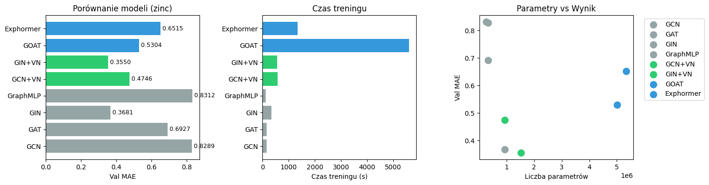
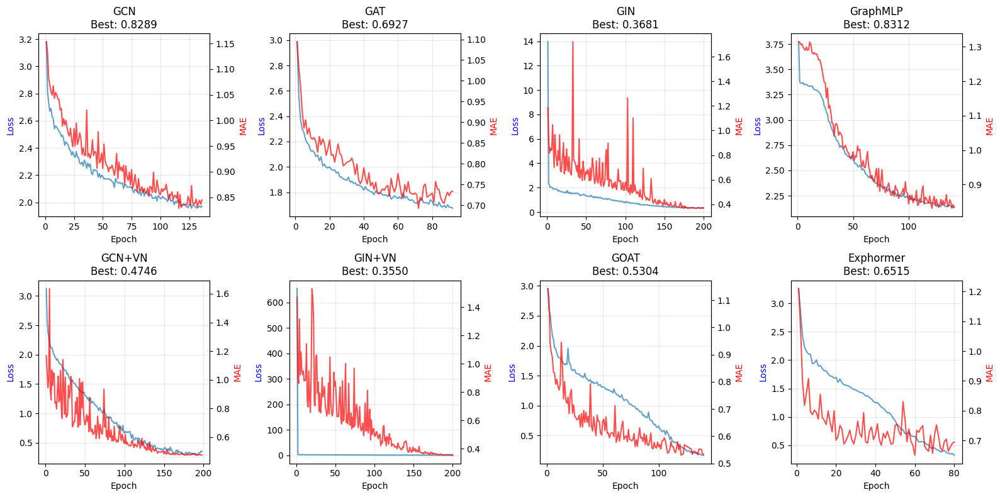
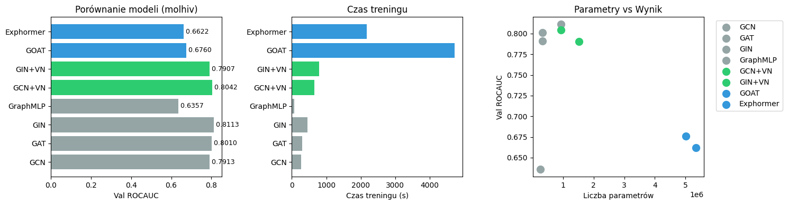
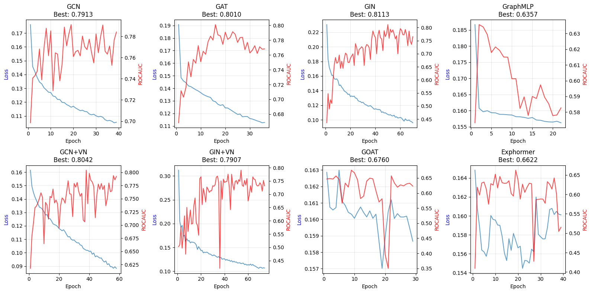
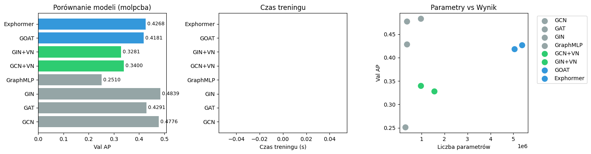
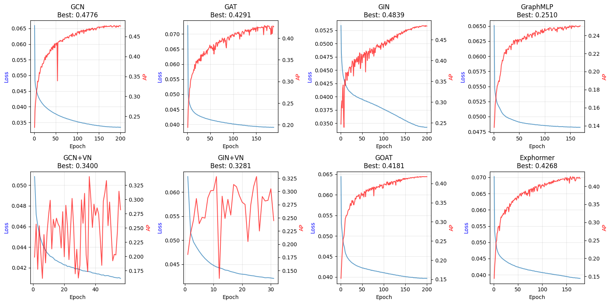

# Graph Neural Networks vs Graph Transformers: Experimental Comparison

This repository implements and compares:
- **classical graph neural networks (GNNs)**, 
- **hybrid models** (GNN + Virtual Node), 
- **graph transformers** 

on molecular and graph-level prediction tasks from the Open Graph Benchmark (OGB) and ZINC.

---

## 1. Project Aim

**Question:** Does global attention (as in Graph Transformers) improve prediction over local message-passing (GNNs) on graph-level tasks?

We compare:

- **Baseline GNNs** — GCN, GAT, GIN, GraphMLP (local or no structure).
- **Hybrid models** — GCN and GIN with a Virtual Node for global information exchange.
- **Graph Transformers** — GOAT (global attention via virtual nodes) and Exphormer (sparse attention via expander graphs).

All models are trained and evaluated on the **same datasets and hyperparameter regime**:

| Parameter | CPU version | GPU version |
|-----------|-------------|-------------|
| **hidden_dim** | 64          | 256         |
| **num_layers** | 3           | 5           |
| **num_heads** | 4           | 8           |
| **dropout** | 0.1         | 0.1         |
| **learning_rate** | 1e-3        | 1e-4        |
| **batch_size** | 32          | 64*         |
| **num_epochs** | 10          | 200         |
| **pe_dim** (positional enc.) | 8           | 16          |
| **early_stopping patience** | 5           | 20          |

\* For ogbg-molpcba (large dataset with ~438K graphs), batch_size is increased to 128 for efficiency.

All models use the same hyperparameter regime so that differences in performance reflect architecture rather than tuning.

**References:**

- Kong et al., *GOAT: A Global Transformer on Large-scale Graphs* (ICML 2023) — `papers/kong23a (1).pdf`
- Shirzad et al., *Exphormer: Sparse Transformers for Graphs* (ICML 2023) — `papers/2303.06147v2.pdf`

---

## 2. Implemented Models

| Model | Type | Complexity | Description |
|-------|------|------------|-------------|
| **GCN** | Baseline | O(E) | Graph Convolutional Network (Kipf & Welling, ICLR 2017) |
| **GAT** | Baseline | O(E) | Graph Attention Network — attention over neighbors |
| **GIN** | Baseline | O(E) | Graph Isomorphism Network — sum aggregation, strong expressivity |
| **GraphMLP** | Baseline | O(N) | MLP on node features only (no graph structure) |
| **GCN+VN** | Hybrid | O(E+N) | GCN + Virtual Node for global context |
| **GIN+VN** | Hybrid | O(E+N) | GIN + Virtual Node + Jumping Knowledge |
| **GOAT** | Transformer | O(N) | Global attention via virtual super-nodes |
| **Exphormer** | Transformer | O(Nd) | Sparse attention via expander graphs |

Code: `models/baselines.py`, `models/hybrid.py`, `models/goat.py`, `models/exphormer.py`.

---

## 3. Datasets

| Dataset | Task | Size | Metric |
|---------|------|------|--------|
| **ZINC** | Regression (molecular property) | ~12K graphs | MAE (lower is better) |
| **ogbg-molhiv** | Binary classification (HIV inhibition) | ~41K graphs | ROC-AUC (higher is better) |
| **ogbg-molpcba** | Multi-label classification (128 tasks) | ~438K graphs | Average Precision (AP, higher is better) |

Data loading: `src/utils/data.py`.

---

## 4. Experimental Setup

- **Hardware:** NVIDIA RTX 3090 (24GB VRAM), AMD Ryzen 9 9950X3D, 96GB DDR5-6000 CL30
- **Shared hyperparameters (GPU mode):** described in the chapter 1

## 5. Results Summary

### 5.1 ZINC (Regression — MAE ↓)

| Rank | Model | Val MAE | Params | Train Time |
|------|-------|---------|--------|------------|
| 1 | **GIN+VN** | **0.355** | ~1.52M | 560s |
| 2 | GIN | 0.368 | ~0.93M | 340s |
| 3 | GCN+VN | 0.475 | ~0.93M | 580s |
| 4 | GOAT | 0.530 | ~5.01M | 5603s |
| 5 | Exphormer | 0.651 | ~5.34M | 1334s |
| 6 | GAT | 0.693 | ~0.33M | 163s |
| 7 | GCN | 0.829 | ~0.33M | 151s |
| 8 | GraphMLP | 0.831 | ~0.26M | 118s |

*Left: Model comparison bar chart showing validation MAE (lower is better). Middle: Training time comparison — transformers (GOAT, Exphormer) take 3-10x longer despite worse results. Right: Parameters vs performance scatter plot — best models (GIN, GIN+VN) achieve lowest MAE with ~1M parameters, while transformers use ~5M.*

*Learning curves for all 8 models: train loss (blue) and validation MAE (red) over epochs. GIN and GIN+VN show stable convergence with lowest validation error. Transformers exhibit higher variance and slower convergence.*

**Takeaway:** GIN and GIN+VN clearly outperform the rest. Virtual Node helps (GCN+VN vs GCN). Transformers (GOAT, Exphormer) are worse than the best GNNs despite more parameters and 3-10x longer training time.

---

### 5.2 ogbg-molhiv (Binary classification — ROC-AUC ↑)

| Rank | Model | Val ROC-AUC | Params | Train Time |
|------|-------|-------------|--------|------------|
| 1 | **GIN** | **0.811** | ~0.93M | 450s |
| 2 | GCN+VN | 0.804 | ~0.93M | 656s |
| 3 | GAT | 0.801 | ~0.34M | 307s |
| 4 | GCN | 0.791 | ~0.33M | 267s |
| 5 | GIN+VN | 0.791 | ~1.52M | 795s |
| 6 | GOAT | 0.676 | ~5.01M | 4720s |
| 7 | Exphormer | 0.662 | ~5.34M | 2166s |
| 8 | GraphMLP | 0.636 | ~0.27M | 67s |

*Left: Model comparison bar chart showing validation ROC-AUC (higher is better). GIN leads with 0.811, followed closely by GCN+VN (0.804) and GAT (0.801). Transformers score significantly lower (0.676, 0.662). Middle: Training time — GOAT takes ~10x longer than best GNNs. Right: Parameters vs performance — top GNNs achieve best scores with ~0.3-1M parameters.*

*Learning curves showing train loss (blue) and validation ROC-AUC (red) over epochs. GIN, GCN+VN, and GAT show stable convergence to high scores. Transformers plateau at lower performance levels.*

**Takeaway:** Best results are from GIN and GCN+VN. GAT and GCN are close. Transformers (GOAT, Exphormer) lag behind the top GNNs by ~0.13-0.15 ROC-AUC despite using 5x more parameters. Virtual Node helps GCN (GCN+VN > GCN) but not clearly GIN on this dataset.

---

### 5.3 ogbg-molpcba (Multi-label — AP ↑)

| Rank | Model | Val AP | Params | Train Time |
|------|-------|--------|--------|------------|
| 1 | **GIN** | **0.484** | ~0.96M | N/A* |
| 2 | GCN | 0.478 | ~0.37M | N/A* |
| 3 | GAT | 0.429 | ~0.37M | N/A* |
| 4 | Exphormer | 0.427 | ~5.37M | N/A* |
| 5 | GOAT | 0.418 | ~5.04M | N/A* |
| 6 | GCN+VN | 0.340 | ~0.96M | N/A* |
| 7 | GIN+VN | 0.328 | ~1.56M | N/A* |
| 8 | GraphMLP | 0.251 | ~0.30M | N/A* |

\* Training times not available — models were loaded from checkpoints after training crashes, and checkpoint format didn't preserve training time metadata.

*Left: Model comparison bar chart showing validation Average Precision (higher is better). GIN (0.484) and GCN (0.478) lead, while transformers are mid-pack (0.427, 0.418). Virtual Node variants show severe underperformance (0.340, 0.328). Middle: Training time plot — values are 0.0 as models were loaded from checkpoints without time metadata. Right: Parameters vs performance — best models use ~0.4-1M parameters, transformers use ~5M with worse results.*

*Learning curves for all models on the large molpcba dataset (~438K graphs). GIN and GCN show stable convergence to best scores. Virtual Node variants (GCN+VN, GIN+VN) exhibit poor performance, suggesting overfitting or suboptimal hyperparameters for this dataset size.*

**Takeaway:** GIN and GCN are best; GAT and both transformers are mid-pack. On this large multi-label dataset, Virtual Node variants (GCN+VN, GIN+VN) perform significantly worse than their non-VN counterparts (0.14-0.16 AP lower), suggesting possible overfitting or need for different hyperparameters/regularization.

---

## 6. Conclusions

1. **GIN consistently performs best** — ranks 1st or 2nd on all three datasets (ZINC: 0.368, molhiv: 0.811, molpcba: 0.484). GIN+VN wins on ZINC (0.355) but underperforms plain GIN on molhiv (0.791 vs 0.811) and molpcba (0.328 vs 0.484).

2. **Virtual Node effect is inconsistent** — helps GCN on ZINC (0.475 vs 0.829) and molhiv (0.804 vs 0.791), but hurts both GCN and GIN on molpcba (GCN+VN: 0.340 vs GCN: 0.478; GIN+VN: 0.328 vs GIN: 0.484). The large performance drop on molpcba suggests VN variants may overfit or need different regularization.

3. **Transformers underperform despite more parameters** — GOAT and Exphormer use ~5M parameters (vs ~1M for best GNNs) but score worse: on ZINC they rank 4th-5th (0.530, 0.651 vs best 0.355), on molhiv they rank 6th-7th (0.676, 0.662 vs best 0.811), and on molpcba they're mid-pack (0.418, 0.427 vs best 0.484). Training time is also 3-10x longer.

4. **GraphMLP confirms structure matters** — consistently worst (ZINC: 0.831, molhiv: 0.636, molpcba: 0.251), showing that ignoring graph structure severely limits performance.

5. **Best efficiency: GIN or GCN** — top results come from models with ~0.3-1M parameters, while transformers use ~5M and train much slower. For these molecular tasks, simple GNNs offer better accuracy/compute trade-off than graph transformers.

**Summary:** On these molecular benchmarks, well-tuned GNNs (especially GIN) outperform graph transformers while using fewer parameters and less compute. Global attention doesn't provide clear benefits here, possibly because molecular graphs are relatively small and local structure is sufficient for these tasks.
